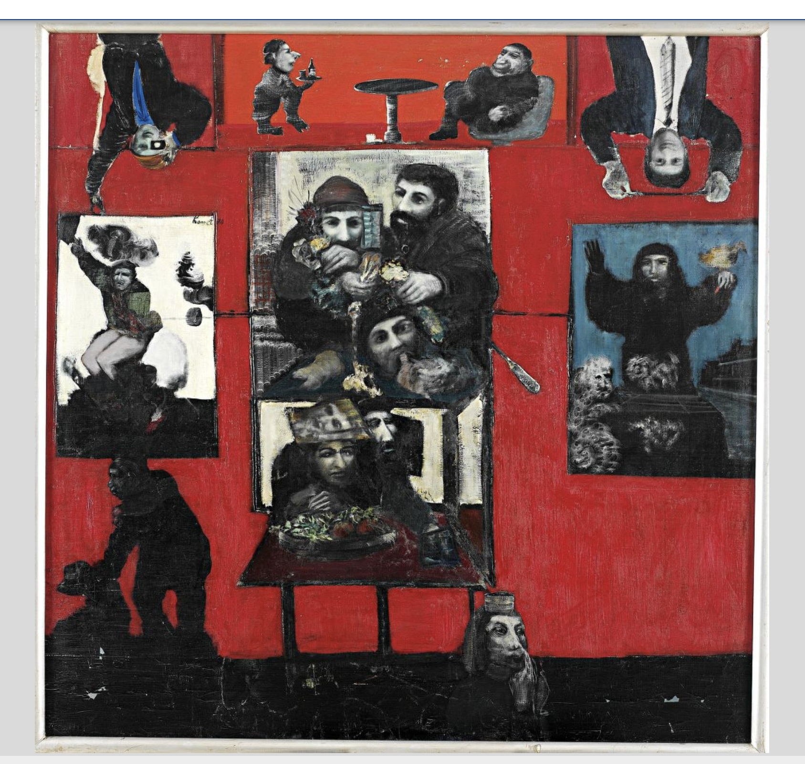
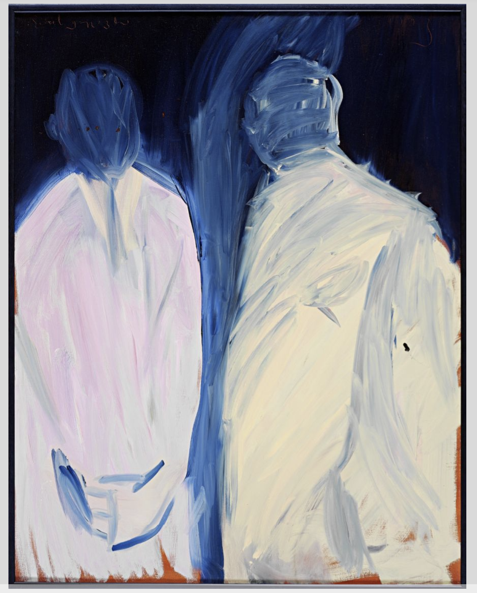
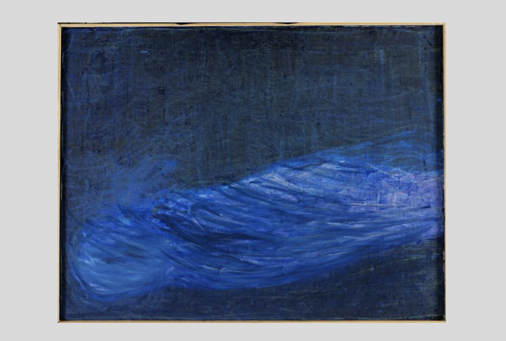

---

layout: post
title: Digital Library of Middle-East
excerpt: "Metdata Assignment"
modified: 2/1/2023 9:00:24
tags: [intro, beginner, jekyll, tutorial]
comments: true
category: blog
permalink: /dlme-assignment/
---

# What is metadata?

What is metadata? Obviously, as the name suggests the name suggests that it has something to do with data. Some kind of data, perhaps? Let's check what *meta* and *data* individually mean.

**Meta**
: *(of something that is written or performed) referring to itself or to something of its own type* [^1]

**Data**
: *information, especially facts or numbers, collected to be examined and considered and used to help decision-making, or information in an electronic form that can be stored and used by a computer* [^2]

Metadata is "data that provides information about other data",but ***not the content of the data***, such as the text of a message or the image itself. For example: the name of the author, published date, publisher, genre and format are a book’s metadata. But metadata can not include its content: poems, storyline or any sentence. In short, Metadata is a pointer. It points towards the content by providing many properties so that we can find that but does not include anything from that data. We also commonly use them in our daily life unknowingly. Yes, when you search “Top 10 action films 2023”, you are taking help of metadata. Top 10 **Rank**, Action **genre**, 2023 **Release date** are all the metadata of the film you’ll finally watch.Metadata is very commonly used in data management and other fields of computer science and information science. 

>In short, Metadata is a pointer. It points towards the content by providing many properties so that we can find that but does not include anything from that data.

# What is discoverability?

**Discoverability**
: *the quality of being easy to find on a website, using a search engine, etc.* [^3]

Yes, discoverability is how easily one content can be found on the internet or database. To increase the discoverability, metadata is widely used for example sometimes, contents are sorted according to some specific orders, alphabetically, most viewed or most popular, most recent etc.

# What is metadata in DLME?

The Digital Library of the Middle East (DLME) offers free and open access to the rich cultural legacy of the Middle East and North Africa by bringing together collections from a wide range of cultural heritage institutions. Developed by an engineering team from CLIR and Stanford Libraries, the platform federates and makes accessible data about collections from around the world. And in this post, we discuss the metadata in DLME.

I have chosen three paintings: Soyut, Paylama and Good Morning. The DLME platform's metadata for the three photographs includes details like the item's title, the creator's name, the item's creation date, and the item's source. I have shown them in a table to make it easier to understand the difference and the similarities.

| Painting    | Artist      |  Date         |  Type         |
| :---        |    :----:   |         :---: |          ---: |
| Good Morning| Komet       | 1974          | Oil on canvas |
| Soyut       |Şenol Yorozlu| Undated       | Oil on canvas |
| Paylama     |Şenol Yorozlu| 1993          | Oil on canvas |

[Good Morning by Komet](https://dlmenetwork.org/library/catalog/ResimKlksyn%2F1042)

[Paylama by Şenol Yorozlu](2https://dlmenetwork.org/library/catalog/ResimKlksyn%2F933)

[Soyut by Şenol Yorozlu](https://dlmenetwork.org/library/catalog/ResimKlksyn%2F942)

# What do we get from the Metadata? : 

As we can see Paylama and Soyut are by the same Turkish painter Yorozlu, Şenol whereas Good Morning is  by Komet. All of them were painted using oil color on canvas . Paylama and Good Morning both were painted in late 20th century and the date , for Soyut , is unknown. All of them are abstract art forms but absolutely have different art techniques. Good morning is more detailed compared to two other paintings; bold and dark colors were used to express strong emotions like rage, fear and anger. However, in Paylama which literally means Reproaching, cool colors were used with simple and strong strokes. In Soyut, (“Abstract” literal meaning), blue solid strokes were used to paint an abstract figure.
The holding institution an data provider for all three paintings is Sakip Sabanci Museum and Sabancı Üniversitesi Sakıp Sabancı Müzesi holds the rights.

# Discoverability of these images:

I made an effort to search the paintings using only the most basic criteria, such as the painting's title and artist. Even with the painting's name, it was challenging to locate them. This is most likely a result of the artworks' names not being  unique. Nonetheless, finding Paylama and Soyut became simpler after the artist's name was added. Even having the name of the artist, finding Good Morning was still challenging. After doing some basic research, I discovered that Komet is actually the artist's pseudonym whereas his real name is Gürkan Coşkun. But once he used his true name, it was simpler to locate some of his other works. But Good Morning still remained difficult.

# What can we do to improve?

Google offered me the definition of the words when I searched because the names of two paintings were in Turkish. Thus, I believe that the painting's metadata should include both the Turkish and English names in addition to a more detailed description of the painting's type rather than merely writing Resim (picture). It's important to mention the artworks' genre as well. 

# Thoughts on the response of ChatGPT:

Here is how chatGPT responds to the follwing prompt about discoverability: 

> What is the importance of metadata to the discoverability of cultural objects in federated digital libraries?  How complete are they usually? What is the cost of metadata? How can we make it better? 

*Metadata is critical to the discoverability of cultural objects in federated digital libraries. It serves as a bridge between the physical object and the digital representation of that object, providing information about its creator, subject, format, and other relevant details. Metadata allows users to search, browse, and filter digital collections, which is essential to finding the resources they need.*

*Incomplete metadata can have a significant impact on the discoverability of cultural objects. For example, if an object is missing key metadata, such as its creator or date, it may not show up in search results or may be difficult to find among other similar objects. Additionally, inconsistent or inaccurate metadata can lead to confusion or errors when using digital libraries.*

*The cost of metadata varies depending on the size and complexity of the collection, as well as the resources available for creating and maintaining metadata. Creating high-quality metadata can be time-consuming and resource-intensive, requiring skilled staff and specialized tools. However, the cost of metadata can be reduced through the use of automated tools and crowdsourcing, which can help to streamline the process and make it more cost-effective.*

*To make metadata better, it is important to invest in creating high-quality metadata at the outset of a project and to maintain it over time. This requires a commitment to standards and best practices for metadata creation and management, as well as ongoing training and support for staff involved in metadata creation. Additionally, it is important to involve end-users in the process of creating metadata, as they can provide valuable insights and feedback on the usability and effectiveness of the metadata.*

I believe Chatgpt is really providing a very broad overview of the subject. It obviously covers the fundamentals, however it doesn't actually analyze these issues in-depth. Furthermore, it doesn't provide a solution to these queries for any particular collection of objects or pictures. For instance, I went into great detail in my research of the metadata for the artworks to show how they differ and how they are similar, as well as whether or not they are easily discoverable. Nevertheless, in the instance of ChatGPT, it simply provided a relatively neutral response, which is OK for someone who is just learning about these subjects but ineffective for more in-depth examination.

References:

1. “Metadata.” Wikipedia, Wikimedia Foundation, 3 March. 2023, https://en.wikipedia.org/wiki/Metadata. 

2. “Data.” Wikipedia, Wikimedia Foundation, 3 March. 2023, https://en.wikipedia.org/wiki/Data 

3. “Discoverability.” Wikipedia, Wikimedia Foundation, 3 Marcg. 2023, https://en.wikipedia.org/wiki/Discoverability.

