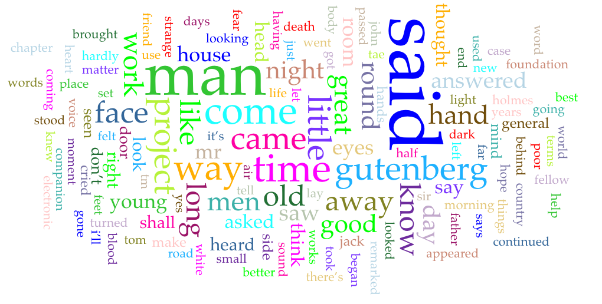
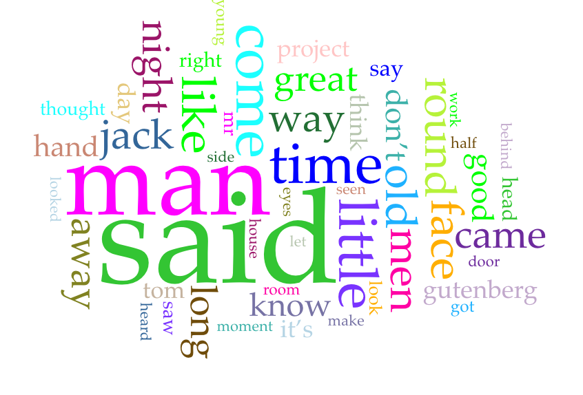
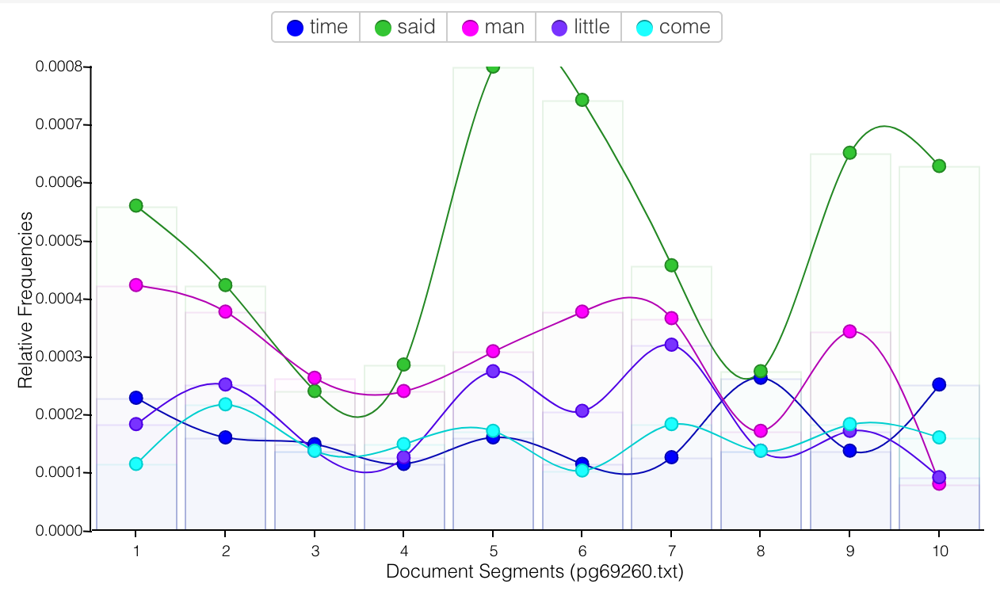
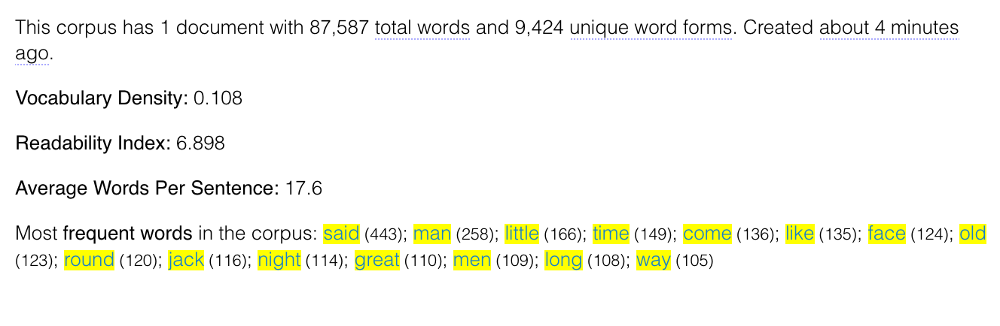
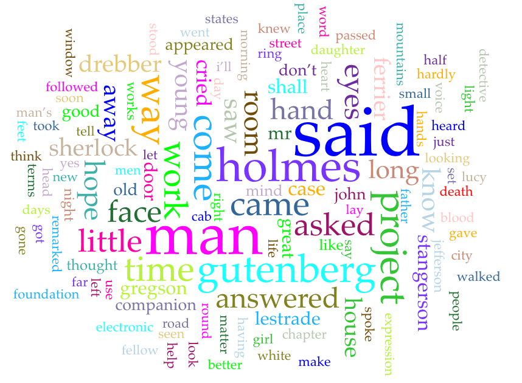
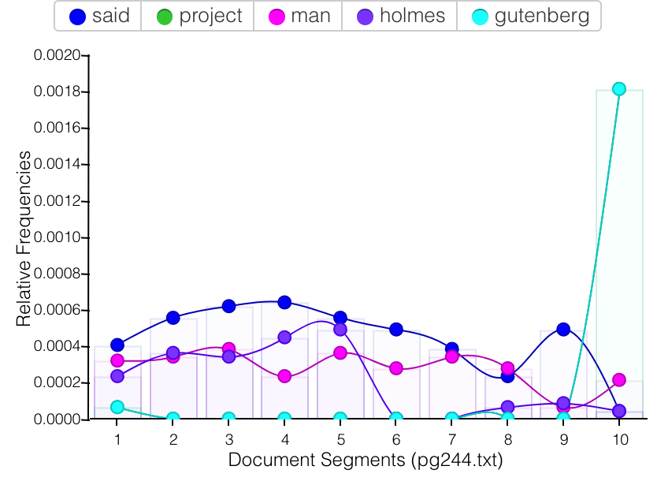
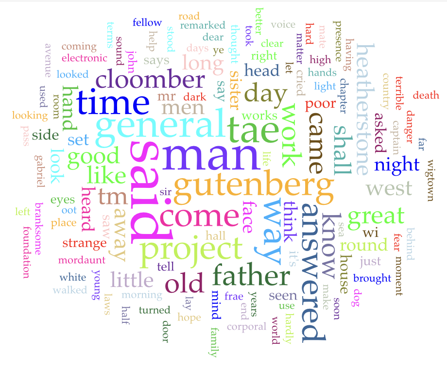
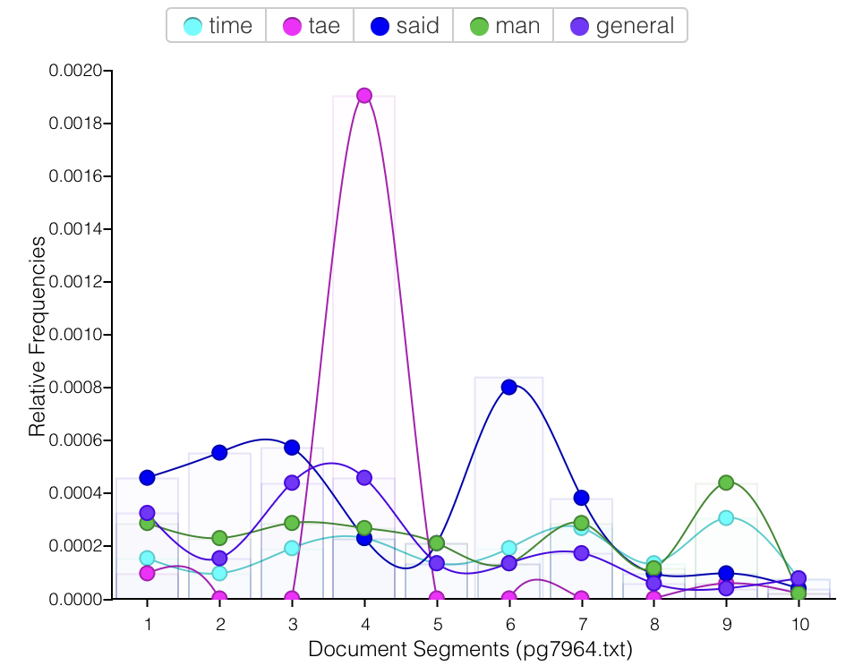
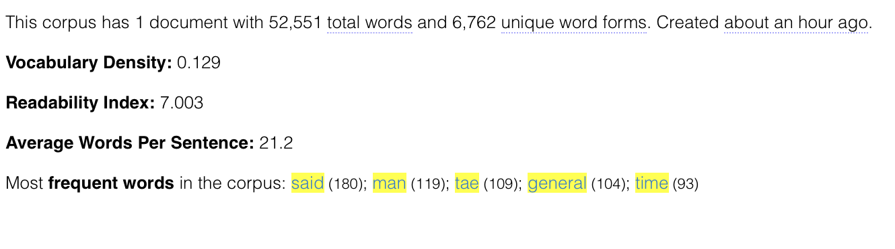

---

layout: post
title: Comparison between corpora
excerpt: "The Corpus Assignment"
modified: 2/1/2023 9:00:24
tags: [intro, beginner, jekyll, tutorial]
comments: true
category: blog
permalink: /corpus-assignment/
---

## What is Corpus? 

**Corpus**
: A large and structured collection of written or spoken texts that are used for linguistic analysis and research.[^1] 

The texts in a corpus can come from a variety of sources, such as books, newspapers, magazines, speeches, conversations, or any other form of written or spoken communication.Corpora are used for a variety of purposes in linguistics and natural language processing, such as developing language models, studying language variation and change, identifying patterns in language use, and evaluating the performance of language technologies.
For example, the British National Corpus (BNC) is a corpus of modern British English that contains over 100 million words from a variety of sources, including newspapers, magazines, academic journals, and spoken conversations. Linguists and natural language processing researchers can use the BNC to study various aspects of the English language, such as vocabulary, grammar, syntax, and discourse. Another example is the Corpus of Contemporary American English (COCA), which is a corpus of American English that contains over 560 million words from various sources, such as fiction, newspapers, academic texts, and spoken conversations.

# Why is Corpus helpful? 

Corpus is helpful because it is a large and organized collection of texts or spoken language that is used for linguistic analysis and research. Here are some reasons why corpus is useful:

***Language analysis***: Corpus provides a wealth of linguistic data that can be used to study different aspects of language such as grammar, vocabulary, syntax, and discourse. Linguists can analyze the frequency, collocation, and distribution of words and phrases in different contexts, and identify patterns and trends in language usage.

***Language learning***: Corpus can be used as a resource for language learners to improve their vocabulary, grammar, and writing skills. Learners can study authentic texts in context and learn how words and phrases are used in different situations.

***Machine learning***: Corpus is a valuable resource for developing natural language processing (NLP) algorithms and training machine learning models. By analyzing patterns in the language data, these algorithms can be used to automate tasks such as text classification, sentiment analysis, and machine translation.

***Discourse analysis***: Corpus can be used to analyze different types of discourse such as academic texts, legal documents, and social media posts. By analyzing the language used in these contexts, researchers can gain insights into the social and cultural factors that influence language use.

Overall, corpus is a valuable resource for linguistics research, language learning, and machine learning applications. It provides a rich source of language data that can be analyzed and used to gain insights into the structure, usage, and meaning of language.

#  Metadata about the chosen Texts

For our upcoming assignment, my groupmate Yaakulya and I have selected three of Arthur Conan Doyle's gripping crime novels to delve into. These captivating works include *My Friend the Murderer*[^2], *A Study in Scarlet*[^3], and *The Mystery of Cloomber*[^4].

**Arthur Conan Doyle**, a distinguished British writer and physician, made his mark on literature with his outstanding detective and crime novels. Along with practicing medicine, he was an accomplished writer of short stories. However, he skyrocketed to fame after creating one of the most beloved fictional characters of all time, the brilliant detective Sherlock Holmes.[^5]
In our quest to analyze and explore these three intriguing novels, we examined the plot, character development, language usage, and thematic elements present in Conan Doyle's writing. These texts are sure to provide us with a riveting journey into the realm of crime and mystery, and we eagerly anticipate delving into the works of this iconic author.

| Book    | Genre      |  Date         |  Notes        |
| :---        |    :----:   |         :---: |          ---: |
| My friend the murderer| Detective       | 1887         | Short stories|
| A study of the scarlet     | Detective | 1887       | Sherlock Holmes series|
| The Mystery of Cloomber      | Mystery| 1888          | Fictional novel|

# Tools Used: 

To conduct a thorough analysis of these captivating crime novels, my groupmate Yaakulya and I turned to cutting-edge digital tools. Specifically, we utilized the ***Voyant tool*** to delve deeper into the intricate layers of Arthur Conan Doyle's writing.
The Voyant tool provided us with a dynamic platform for exploring the novels' various elements, including word usage, frequency, and patterns. With this innovative software, we were able to identify key themes and motifs that permeated throughout the texts, gaining invaluable insights into Conan Doyle's writing style.

# Analysis of the books

Analysis of all the three books combined:

Given Scale: 135 
Highest repeated word : ***said***(830), #1: 207 counts, #2: 443 counts, #3: 108 counts 
Smallest repeated word : ***there’s*** (64), #1: 13 counts, #2: 52 counts, #3: 0 Counts

In our initial analysis, we examined all three novels concurrently using the powerful Voyant tool, which enabled us to identify general themes and trends within the texts. Our focus was on the top 135 words that appeared repeatedly across all three works, and one word stood out in particular: "said." This ubiquitous word was used a total of 830 times throughout the three novels, with "My Friend the Murderer," "A Study of the Scarlet," and "The Mystery of Cloomber" featuring it 207, 443, and 180 times, respectively.

The prevalence of the word "said" may suggest that these crime novels are rich in dialogue, a common characteristic of the mystery and detective fiction genres. In such genres, dialogue is often used as a tool to reveal crucial information and advance the plot. 

> As the novels are works of fiction, the author must naturally create a diverse range of characters and conversations for them, thus leading to the frequent repetition of the word "said" in order to establish who is speaking and move the dialogue forward.

Another surprising word that emerged as one of the most frequently repeated in all three novels was "man," appearing a total of 509 times, making it the second most repeated word overall. One possible reason for this frequent use of the word "man" could be the genre of the books themselves. As works of mystery and detective fiction, the novels likely feature numerous unknown characters or suspects, and the word "man" may have been used as a generic term to refer to these individuals. This also suggests that the majority of the characters in these novels were likely male, as the word "man" is typically gendered.
Moreover, given that these novels are from the nineteenth century, when female detectives were not yet common, the overuse of the word "man" is not surprising. The author's use of this term may reflect the prevailing attitudes and assumptions of the time, where men were viewed as the primary actors and decision-makers in society, and women were relegated to supporting roles. Overall, the word "man" serves as a powerful reminder of the historical context and social dynamics that shaped the writing of these renowned crime novels.

Aside from the specific words such as "man" and "said," we also found that the most common words in each of the texts were the names of the main characters, the locations where the events took place, and certain cultural, regional, or religious indicators that provide context to the story.
For instance, in "The Mystery of Cloomber," words such as "Singh," "Buddhist," "corporal," and "general" suggest that this novel has some connection to India and military affairs. This gives us a sense of the cultural and historical background of the story and helps us to understand the context in which the events unfold.
By examining the most commonly used words in each of these novels, we can gain insight into the themes, settings, and characters that the author wanted to emphasize, and deepen our understanding of the rich and complex worlds that Arthur Conan Doyle created in his crime fiction.

# Analytical data from the Book 1: My friend The Murderer

Through a meticulous analysis of the corpus data, a noteworthy finding emerged in the form of the word "said" being frequently utilized in the middle sections of the book, more specifically in segments 4 through 6. This observation suggests that these particular portions were predominantly driven by dialogue, as opposed to descriptive prose. In other words, these segments were more focused on conversations between characters, resulting in a more dynamic and engaging reading experience.

The significance of this finding lies in the fact that it sheds light on the structure of the book and how the author crafted different parts of the narrative. By utilizing the word "said" frequently in the middle segments, the author was able to create an immersive experience for the reader by placing them directly in the midst of character interactions. This technique allowed the author to convey the emotions and attitudes of each character in a more organic and natural way, making them seem more authentic and relatable.

Furthermore, this analysis also suggests that other sections of the book were more descriptive and less dialogue-driven. This serves to create a sense of balance in the narrative, providing the reader with moments of introspection and reflection, while also allowing for moments of heightened tension and excitement in the dialogue-heavy segments. This discovery highlights the effectiveness of utilizing dialogue as a tool to engage readers and create a more immersive experience. It also emphasizes the importance of balancing dialogue and descriptive prose to create a well-rounded and captivating narrative.

# Analytical data from the Book 2: A Study In Scarlet

Upon careful examination of this corpus data, it is evident that the term "Gutenberg" was solely employed in the first and last segments of the book. This finding suggests that the term was not utilized within the actual content of the book, despite being among the most frequently occurring words in the book's text format.

This observation is particularly interesting because the book was obtained from Project Gutenberg, a digital library that provides access to free e-books. It is possible that the term "Gutenberg" was mentioned in the metadata section located at the beginning and the end of the book, which provides information about the book's author, publisher, and copyright status.

The fact that the term "Gutenberg" was only used in the metadata sections indicates that the author did not directly reference the digital library or its mission within the narrative. However, the use of Project Gutenberg as a source for the text version of the book highlights the growing importance of digital libraries and the impact they have on literature and reading habits. This finding emphasizes the significance of paying attention to the context in which words are used in a text, as it can provide valuable insights into the author's intentions and the underlying themes of the book.

# Analytical data from Book 3: The Mystery of Cloomber

Upon conducting a thorough analysis of the corpus data, it became apparent that the third book exhibited a considerably higher vocabulary density in comparison to the preceding two books. This finding suggests that the author utilized a more diverse range of words and expressions in the third book, which could indicate a more sophisticated writing style or a greater emphasis on character development.

Additionally, the term "tae" was found to be used more frequently than "said," particularly in segments 3 to 5 of the book. This observation implies that these segments were heavily dialogue-driven and likely featured more descriptive sentences, portraying characters engaged in intense conflicts and conversations. The concentration of "tae" in these parts highlights the author's skill in creating dialogue that is engaging and emotionally charged, providing the reader with a more immersive reading experience.

The prevalence of "tae" in the dialogue-heavy sections further suggests that the characters in these segments were grappling with significant issues, adding to the depth and complexity of the story. This could indicate a shift in the narrative, moving towards more intense conflicts and character development, which is often a sign of a well-crafted and thought-provoking storyline. This analysis provides insight into the stylistic and narrative choices made by the author in the third book. It highlights the use of language and dialogue as powerful tools for engaging readers and creating a sense of immersion in the story.

# Conclusion and Findings 
In order to explore the world of detective novels, we turned our attention towards the works of Arthur Conan Doyle. As a highly acclaimed writer in the genre, we were eager to delve into his body of work, with the expectation that we would be encountering contemporary prose. However, we soon discovered that many of the events in his novels took place in nineteenth century England, with a significant amount of vocabulary related to specific English locations and antiquated language that is no longer in common use.
To aid in our analysis, we employed the Voyant tool, which helped us uncover these general observations with much greater efficiency than if we were to rely solely on linear reading. However, we did encounter one obstacle while working with the texts from Project Gutenberg, which was that the books contained metadata within their text format. This resulted in the most commonly used words being "Project" and "Gutenberg," which the Voyant tool was unable to exclude from its analysis. Unfortunately, we were unable to find a tool that would allow us to easily remove this extraneous text within the Voyant platform itself, and doing so manually would be impractical when working with large volumes of text.
Despite this limitation, we found that the Voyant tool was highly effective in analyzing English language texts, and we believe that it would also prove useful for European languages and languages that share a similar alphabet. For instance, commonly used languages like Chinese and Spanish, which have a substantial digital database, should be compatible with this tool.

## Guiding Questions: 

1) What did you know about the subject before you began your analysis?
Before beginning our analysis, we have had some general knowledge about the subject. We knew that detective novels were a popular genre of fiction, especially during the nineteenth century. We had also heard of some well-known detective writers such as Arthur Conan Doyle and Agatha Christie, who are considered to be masters of the genre. Additionally, we had a basic understanding that detective novels often involve a crime or mystery that needs to be solved by a detective or amateur sleuth. However, we did not have an in-depth knowledge of the genre or any specific texts, and we were excited to dive deeper into the subject through our analysis.

2) Were there any surprises in your exploration?
There were some surprises during our exploration. One of the surprising findings was the high frequency of the word "Man" in all three novels we analyzed. It was the second most repeated word in the corpus. We speculated that this could be due to the mystery and detective fiction genre, where many unknown characters or suspects are often referred to as "Man" instead of their actual names. Additionally, it suggests that most of the characters in the novels were likely male, which aligns with the fact that there were not many female detectives in the 19th century when these novels were written.
Another surprise was the prevalence of cultural, regional, and religious indicators in the texts. In particular, we noticed that certain words like "tae," "said," "time," and "man" appeared frequently in "The Mystery of Cloomber," hinting at the novel's Indian and military themes. These observations helped us to better understand the context of the texts and appreciate the nuances of the stories.
Finally, we were surprised by some of the limitations of the Voyant tool we used for our analysis. For instance, the tool could not differentiate between the main text and the metadata included in the Project Gutenberg books we analyzed. As a result, the most frequent words in some cases were "Project" and "Gutenberg," which did not provide useful insights into the content of the novels.

3) How well would this assignment work for a language other than English?

We believe that the assignment could work for languages other than English, but it would depend on the availability and quality of digital text resources for that language. The Voyant tool, which was used for this assignment, supports multiple languages, including French, German, Spanish, Chinese, and many others. However, the accuracy and usefulness of the tool's analysis would depend on the quality of the input text and the extent to which the tool can identify and interpret the language-specific features and nuances of that text. In addition, some languages may not have as much digital text available, which could limit the scope of the analysis. Overall, the assignment could be adapted to work with other languages, but it would require some additional research and adaptation to account for language-specific differences and constraints.

References:

[^1]: Definition from Oxford Languages, google,Google
[^2]:My Friend the Murderer, Project Gutenberg, https://www.gutenberg.org/ebooks/23059
[^3]:A Study in Scarlet, Project Gutenberg, https://www.gutenberg.org/cache/epub/244/pg244.txt
[^4]:The Mystery of Cloomber, Project Gutenberg, https://www.gutenberg.org/cache/epub/7964/pg7964.txt
[^5]:Arthur Conan Doyle, Wikipedia, Wikipedia, https://en.wikipedia.org/wiki/Arthur_Conan_Doyle

